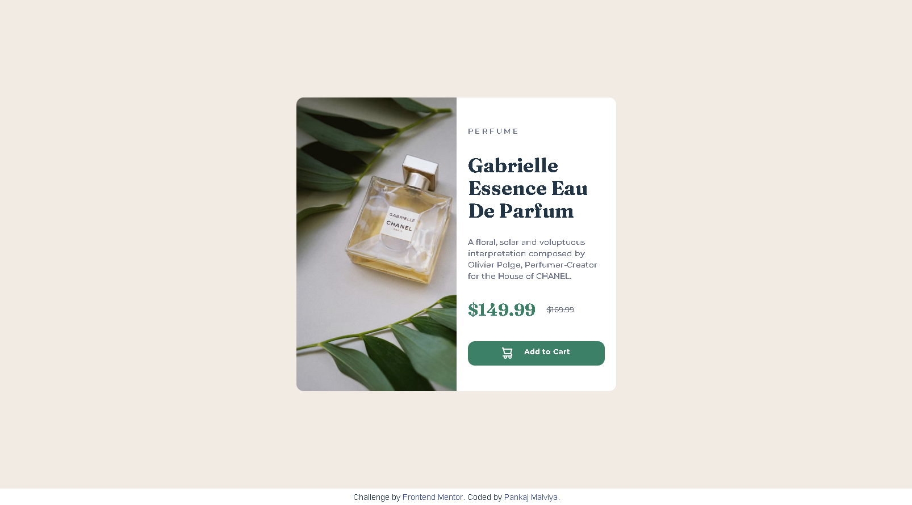

# Frontend Mentor - Product preview card component solution

This is a solution to the [Product preview card component challenge on Frontend Mentor](https://www.frontendmentor.io/challenges/product-preview-card-component-GO7UmttRfa). Frontend Mentor challenges help you improve your coding skills by building realistic projects. 

## Overview

### The challenge

Users should be able to:

- View the optimal layout depending on their device's screen size
- See hover and focus states for interactive elements

### Screenshots
#### Desktop Screenshot

#### Mobile Screenshot

### Links

- Solution URL: [Solution](https://github.com/pankajmalvi/frontend-mentor/tree/product-preview-card-component-main)
- Live Site URL: [Live Site](https://product-preview-pm.netlify.app/)

### Built with

- Vite
- [React](https://reactjs.org/) - JS library

**Note: These are just examples. Delete this note and replace the list above with your own choices**

## Author

- Website - [Pankaj Malviya](https://pankajmalviya.netlify.app/)
- Frontend Mentor - [@yourusername](https://www.frontendmentor.io/profile/pankajmalvi)

